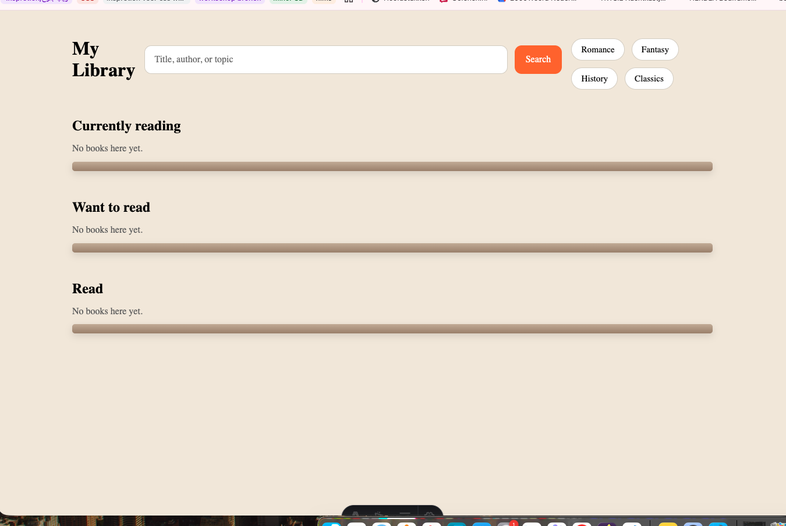

# Astro Starter Kit: Minimal

```sh
npm create astro@latest -- --template minimal
```

> 🧑‍🚀 **Seasoned astronaut?** Delete this file. Have fun!

## 🚀 Project Structure

Inside of your Astro project, you'll see the following folders and files:

```text
/
├── public/
├── src/
│   └── pages/
│       └── index.astro
└── package.json
```

Astro looks for `.astro` or `.md` files in the `src/pages/` directory. Each page is exposed as a route based on its file name.

There's nothing special about `src/components/`, but that's where we like to put any Astro/React/Vue/Svelte/Preact components.

Any static assets, like images, can be placed in the `public/` directory.

## 🧞 Commands

All commands are run from the root of the project, from a terminal:

| Command                   | Action                                           |
| :------------------------ | :----------------------------------------------- |
| `npm install`             | Installs dependencies                            |
| `npm run dev`             | Starts local dev server at `localhost:4321`      |
| `npm run build`           | Build your production site to `./dist/`          |
| `npm run preview`         | Preview your build locally, before deploying     |
| `npm run astro ...`       | Run CLI commands like `astro add`, `astro check` |
| `npm run astro -- --help` | Get help using the Astro CLI                     |

## 👀 Want to learn more?

Feel free to check [our documentation](https://docs.astro.build) or jump into our [Discord server](https://astro.build/chat).

## Woensdag 1 april

Vandaag ben ik begonnen met het verkennen van mogelijke concepten voor de API-opdracht.

In eerste instantie had ik twee ideeën:

Een Pokédex-app
Een boekenapp (vergelijkbaar met Goodreads)

Met een overleg met Cyd  bleek dat het Pokémon-idee wat simpel en minder onderscheidend was. De data en structuur zijn erg duidelijk en makkelijk te implementeren, waardoor er minder ruimte is voor verdieping en creativiteit.

Daarom heb ik besloten om verder te gaan met het boekenconcept.

Ik wil een app maken waarmee gebruikers:

boeken kunnen zoeken en doorbladeren
een detailpagina voor elk boek kunnen openen
boeken kunnen opslaan (bijvoorbeeld als “wil ik lezen”)

De docent adviseerde me ook om de API van Hardcover te gebruiken, die goed past bij dit soort apps.

### De volgende stap
-De gedrukte versie beter bestuderen (eindpunten, gegevensstructuur)
-De eerste opvraagprocedure in Astro testen
-Bepalen welke subpagina’s ik nodig heb (overzicht + details)

#### Concept:
*boekenapi

*features
-search bar
-list of books
-detail page
-favorites
<!-- content-api1: https://openlibrary.org/
     contentapi2: https://hardcover.app/ -->
<!-- web-pi: localStorage
 -->
## Voortgangsgesprek - week 1 
2 april

Tijdens de voortgangsgesprek heb ik mijn concept gepresenteerd: een boekenapp geïnspireerd op Goodreads, omdat ik van lezen houd en deze app zelf ook gebruik.

De feedback die ik heb gekregen:

* Het is een goed en duidelijk idee, maar bedenk wat jouw app uniek of andersmaakt dan Goodreads.
* Denk na over je eigen ervaring: wat mis je in Goodreads of wat kan er verbeterd worden?
* Probeer de API uit en bekijk de gegevensstructuur, zodat je beter kunt bepalen welke functies je wilt toevoegen.
* Overweeg om visuele interacties toe te voegen, zoals scroll-animaties en overgangen.
* Een mogelijk extra concept is een ‘op stemming gebaseerde’ functie, waarbij gebruikers boeken kunnen ontdekken op basis van hun stemming.


## Woensdag 9 april
Vandaag heb ik gewerkt met een content API in mijn Astro-project.
Ik heb de Open Library API gebruikt om boekgegevens op te halen en deze weergegeven op een overzichtspagina.

Ik heb geleerd hoe ik:

-data kan ophalen met fetch()
-JSON-data kan gebruiken (response.json())
-een lijst van boeken kan tonen met .map()
-Daarna heb ik een detailpagina gemaakt met een dynamische route ([...id].astro), zodat elke boek een eigen pagina heeft.
Bronen:

<!-- dynamic routes: https://docs.astro.build/en/guides/routing/ -->
## Voortgangsgesprek - week 2
10 april

Tijdens het voortgangsgesprek heb ik feedback gekregen op mijn project. De belangrijkste punten zijn:
* Filtering en zoeken:
Het filteren en zoeken van boeken moet op de server-side gebeuren, niet via JavaScript op de client.
* Interface (UI):
Meer aandacht besteden aan de interface, vooral voor:
    * de pagina waar boeken worden opgeslagen
    * het beheren van lijsten
* Tags bij boeken:
Bij elk boek een duidelijke tag toevoegen, zoals:
    * genre
    * collectie / categorie
* Visuele stijl per genre:
De “vibe” van een boek visueel weergeven.
Bijvoorbeeld:
    * horror → donkerdere kleuren, sterke box-shadows
    * andere genres → eigen kleuren en stijlen
* Moeilijkheidsgraad APIs:
Volgens Cyd zijn LocalStorage en Web Share API relatief eenvoudig.
Daarom wordt er van mij verwacht dat ik extra focus leg op:
    * UI/UX
    * visuele kwaliteit en interactie

## Week 3
### Wat ik heb gedaan
- Een werkende zoekfunctie toegevoegd met query parameters (`q`)  
- De zoekpagina gescheiden van de homepage voor logischer gebruik  
- Filters toegevoegd via categorieën:  
  - Romance  
  - Fantasy  
  - History  
  - Classics  
- De homepage aangepast naar een duidelijkere structuur:  
  - Search bar  
  - Categorieën onder de search bar  
  - Eigen bibliotheek / saved shelves  
- Navigatie verbeterd tussen home en search  
- Begonnen met Goodreads-geïnspireerde boekstatussen:  
  - Currently Reading  
  - Want to Read  
  - Read  
- localStorage  gebruikt om opgeslagen boeken te bewaren  
- Eerste versie van boekenplanken (shelves) opgezet  

### UX/UI keuzes
- Zoekresultaten niet meer direct op de homepage tonen  
- Home gebruiken als persoonlijke bibliotheek  
- Search als aparte pagina voor ontdekken  
- Categorieën direct zichtbaar maken voor snellere navigatie  

### Waar ik tegenaan liep
- Saved books namen styling niet automatisch over  
- Problemen met layout en responsiveness  
- Onlogische structuur toen alles nog op één pagina stond  



# Week 4
## Wat ik heb gedaan

### Verdere ontwikkeling van de bestaande basis
Deze week heb ik verder gebouwd op de functionele versie van week 3.  
De focus lag minder op “het werkt”, en meer op:
### UX, visuele kwaliteit en gebruikerservaring.

- De homepage visueel verder uitgewerkt richting een sterkere Goodreads / moderne library stijl  
- Mobiele versie als hoofdprioriteit aangepakt  
- Hero section toegevoegd met:
  - achtergrondafbeelding
  - sterkere introductietekst
  - duidelijkere eerste indruk  
- “Currently reading” prominenter gemaakt met laatst bekeken / laatst opgeslagen boek  
- Shelf-secties visueel verbeterd  
- Geëxperimenteerd met realistischere boekenplanken in plaats van simpele lijnen  
- Scroll-driven / coverflow-achtige interacties getest voor boekenrijen  

## Feedback
(Omdat ik niet aanwezig kon zijn bij het voortgangsgesprek, heb ik aan feedback gevraagd:)
### Wat ik merkte:
- De navigatie was nog niet duidelijk  
- De detailpagina had nog geen inhoud of functionaliteit  
- De app werkte deels, maar voelde nog niet compleet  
- Er ontbrak nog interactie en een duidelijke gebruikersflow  

## Boekdetailpagina uitgebreid
- 3D boekexperimenten toegevoegd met CSS:
  - rug
  - pagina’s
  - achterkant
  - schaduw  
- Shelf status direct beheerbaar gemaakt vanuit detailpagina  
- Share knop toegevoegd  
- Responsive layout verbeterd voor mobiel en desktop  

---

## UX/UI keuzes
### Deze week draaide vooral om:
- Meer identiteit geven aan het project  
- Meer focus op sfeer, interactie en visuele beleving  


# Week 5

## Wat ik heb gedaan

### Laatste verbeteringen en afronding
In deze week lag de focus op het afronden van het project en het verbeteren van de gebruikerservaring in detail.

- Navigatie verbeterd door een “Back to search” knop toe te voegen  
- Probleem opgelost waarbij de zoekresultaten verloren gingen bij terug navigeren  
- Interactie van de “Continue reading” sectie verbeterd (klikbaar gemaakt)  
- Layout van de “Continue reading” kaart aangepast voor betere leesbaarheid op desktop  

---

## Detailpagina verder uitgebreid
- Visuele effecten toegevoegd gebaseerd op het genre van het boek  
- Verschillende stijlen en animaties per categorie (romance, horror, fantasy, etc.) voor meer sfeer en beleving 
- Animatie geoptimaliseerd zodat deze direct zichtbaar is en vloeiender aanvoelt  
- Kleine UX verbeteringen toegepast op de detailpagina  

---

## Nieuwe feature: Related books
- Dynamisch gerelateerde boeken opgehaald via de api  
- Gebaseerd op het onderwerp (subject) van het huidige boek  
- Weergave toegevoegd als horizontale lijst onder de detailpagina  
- Klikbare kaarten toegevoegd voor directe navigatie  

Bronnen:
<!-- https://openlibrary.org/developers/api -->
<!-- https://docs.astro.build/en/guides/routing/ -->
<!-- https://developer.mozilla.org/en-US/docs/Web/API/Fetch_API-->
<!-- https://developer.mozilla.org/en-US/docs/Web/API/Window/localStorage-->
<!-- https://piccalil.li/blog/some-practical-examples-of-view-transitions-to-elevate-your-ui/ -->
<!-- https://cydstumpel.nl/a-practical-guide-to-the-css-view-transition-api/ -->


